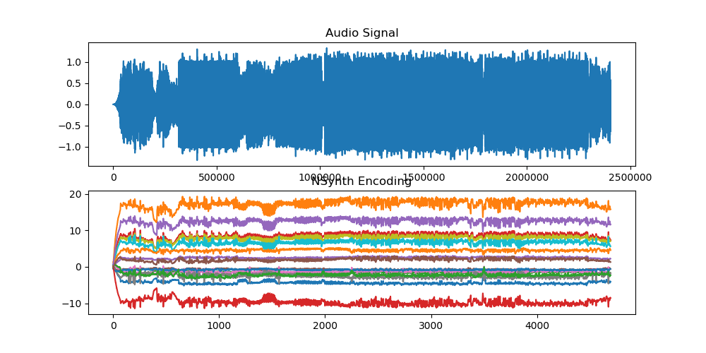

<iframe width="768" height="768"
src="https://www.youtube.com/embed/xQwqnBRirwI
">
</iframe>
<iframe width="768" height="768"
src="https://www.youtube.com/embed/fug9r-B9CmY
">
</iframe>

**See videos at <https://hanhung.github.io/Creating-Audio-Reactive-Visuals-With-StyleGAN/>.*

**See [GETTING_STARTED.md](GETTING_STARTED.md) for how to run code.**

## 1.Introduction

*Fig. 1: Overall workflow of our method*

In this project we use stylegan to create audio reactive visuals for VJ. Given an audio clip we first perform feature extraction using filtering to separate different sounds such as bass and snare. Then for every time-step we calculate the magnitude of changes in these features and map them to movement in the latent space of stylegan (walking in latent space). The latent vectors obtained after this step is joined by style mixing to create an image for every time-step. (See original stylegan [paper](https://arxiv.org/abs/1812.04948) for details on style mixing) Concatenating the images and we obtain a video clip that "dances" to the audio clip. The overall workflow is shown in Fig. 1.

## 2.Experiments

### 2-1.Hand Crafted Features
<iframe width="256" height="256"
src="https://www.youtube.com/embed/D6UG09FOSqw">
</iframe>
<iframe width="256" height="256"
src="https://www.youtube.com/embed/Vxvgc8muBXw">
</iframe>

In this experiment we first perform filtering on the audio clip then calculate the changes in the features for every time-step and map to stylegan according to Fig. 2. Random walk is used to move in latent space by generating a random direction vector for every time-step and multiplying by the magnitude of the change. The max walk length limits the maximum distance the latent vector can move in one time-step. We vary the max walk length for the two videos according to Fig. 2.

| Filter Type   | Frequencies   | Sounds               | Styles (layers) | Effect           | Max Walk Length |
| ------------- |:-------------:|:--------------------:|:---------------:|:----------------:|:---------------:|
| Low Pass      | ~150 Hz       | Bass                 | 0~2             | Coarse Structure | 4 vs 10         |
| High Pass     | 500~5000 Hz   | Mid-High Frequencies | 3~5             | Mid Level        | 4 vs 10         |
| Band Pass     | 200~350 Hz    | Snare                | 6~13            | Fine Detail      | 3 vs 3          |

*Fig. 2: Filter settings and mapping to stylegan*

#### Ablation
<iframe width="256" height="256"
src="https://www.youtube.com/embed/E1RpwpGlC5s">
</iframe>
<iframe width="256" height="256"
src="https://www.youtube.com/embed/gfZam2eK7_o">
</iframe>
<iframe width="256" height="256"
src="https://www.youtube.com/embed/ASxiGrEZY4s">
</iframe>

We conduct some ablation tests by fixing the style vectors from two of the filters and varying one. The videos are results for low pass, high pass and band pass respectively. (The audio in each video is also filtered by the filters so that the correspondances can be seen more easily.

### 2-2.Nsynth Extracted Features
<iframe width="256" height="256"
src="https://www.youtube.com/embed/kmUsZmb7GGM">
</iframe>

Using Nsynth, a wavenet-style encoder we enode the audio clip and obtain 16 features for each time-step (the resulting encoding is visualized in Fig. 3). We discard two of the features (because there are only 14 styles) and map to stylegan in order of the channels with the largest magnitude changes.

*Fig. 3: Visualization of encoding with Nsynth*

### 2-3.Learned Walks
<iframe width="256" height="256"
src="https://www.youtube.com/embed/lBnNRk_vwfI">
</iframe>

In this experiment we learn a walk vector in the latent space of stylegan that corresponds to a specific effect (color) using techniques from a recent paper by [Jahanian, Ali et al](https://ali-design.github.io/gan_steerability/). We map low pass, band pass and high pass filter features to the alpha sliders for RGB channels of the image.

## 3.Resources

Paper: [Stylizing Audio Reactive Visuals](https://neurips2019creativity.github.io/doc/Stylizing%20Audio%20Reactive%20Visuals.pdf)

Code: https://github.com/hanhung/Creating-Audio-Reactive-Visuals-With-StyleGAN

StyleGan Code, LSUN bedroom and celeba pretrained models:　
https://github.com/NVlabs/stylegan

Painting Pretrained Model:
https://www.reddit.com/r/MachineLearning/comments/bagnq6/p_stylegan_trained_on_paintings_512x512/

### Music

Track: Rob Gasser - Hollow (feat. Veronica Bravo) [NCS Release]

Music provided by NoCopyrightSounds.

Watch: https://youtu.be/L14hxW2SN68

Free Download / Stream: http://ncs.io/RGHollow
