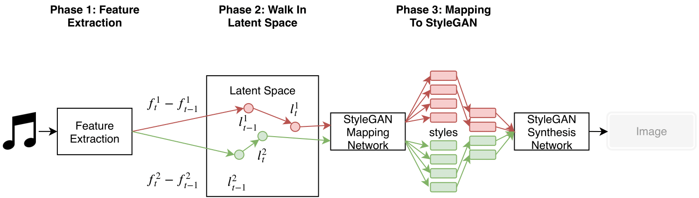

## Introduction


*Fig. 1: Overall workflow of our method*

In this project we use stylegan to create audio reactive visuals for VJ. Given an audio clip we first perform feature extraction using FFT and filtering to separate different sounds such as bass and snare. Then for every time-step we calculate the magnitude of changes in these features and map them to movement in the latent space of stylegan. The latent vectors obtained after this step is joined by style mixing to create an image for every time-step. (See original stylegan [paper](https://arxiv.org/abs/1812.04948) for details on style mixing) Concatenating the images and we obtain a video clip that "dances" to the audio clip. The overall workflow is shown in Fig. 1.

## Expermiments

### Hand Crafted Features
<iframe width="256" height="256"
src="https://www.youtube.com/embed/VvSlL5QFdhI">
</iframe>
<iframe width="256" height="256"
src="https://www.youtube.com/embed/lVszLh0iUs4">
</iframe>
<iframe width="256" height="256"
src="https://www.youtube.com/embed/wR-pnOy8R9k">
</iframe>
<iframe width="256" height="256"
src="https://www.youtube.com/embed/07A5MKOW7y4">
</iframe>

In the first video we have the synthesized video using features extracted using FFT and filtering then using random walk to navigate the latent space. In Fig. 2 we list our our filter settings and the stylgan mapping layers. We also do some ablation tests by only taking input from the low pass, band pass and high pass individually (last three videos respectively).

| Filter Type   | Frequencies   | Sounds               | Styles (layers) | Effect           |
| ------------- |:-------------:|:--------------------:|:---------------:|:----------------:|
| Low Pass      | ~150 Hz       | Bass                 | 0~2             | Coarse Structure |
| Band Pass     | 200~350 Hz    | Snare                | 3~5             | Mid Level        |
| High Pass     | 500~5000 Hz   | Mid-High Frequencies | 6~13            | Fine Detail      |

*Fig. 2: Filter settings and mapping to stylegan*

### Nsynth Extracted Features

### Learned Walks

## Resources

Paper: Coming Soon

Code: Coming Soon

### Markdown

Markdown is a lightweight and easy-to-use syntax for styling your writing. It includes conventions for

```markdown
Syntax highlighted code block

# Header 1
## Header 2
### Header 3

- Bulleted
- List

1. Numbered
2. List

**Bold** and _Italic_ and `Code` text

[Link](url) and 
```

For more details see [GitHub Flavored Markdown](https://guides.github.com/features/mastering-markdown/).

### Jekyll Themes

Your Pages site will use the layout and styles from the Jekyll theme you have selected in your [repository settings](https://github.com/hanhung/DeepVJ/settings). The name of this theme is saved in the Jekyll `_config.yml` configuration file.

### Support or Contact

Having trouble with Pages? Check out our [documentation](https://help.github.com/categories/github-pages-basics/) or [contact support](https://github.com/contact) and we’ll help you sort it out.
